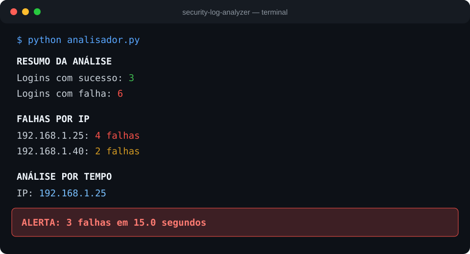

<div align="center">

# 🔐 Security Log Analyzer

Analisador de logs de autenticação desenvolvido em Python para identificar padrões compatíveis com tentativas de força bruta.


</div>

## Sobre o projeto

O programa processa eventos de autenticação, contabiliza sucessos e falhas por endereço IP e gera um alerta quando encontra três falhas do mesmo IP dentro de uma janela de 60 segundos.

## Funcionalidades

- Leitura de arquivo de log
- Separação de data, IP, evento e usuário
- Contagem de logins bem-sucedidos e malsucedidos
- Agrupamento de falhas por endereço IP
- Detecção temporal de possível ataque de força bruta
- Tratamento de linhas vazias, incompletas e datas inválidas

## Estrutura

```text
security-log-analyzer/
├── analisador.py
├── logs/
│   └── exemplo.log
└── README.md
```

## Formato do log

```text
AAAA-MM-DD HH:MM:SS | ENDEREÇO_IP | EVENTO | USUÁRIO
```

Eventos reconhecidos: `LOGIN_SUCESSO` e `LOGIN_FALHA`.

## Como executar

```powershell
python analisador.py
```

## Demonstração visual

> Saída real validada, apresentada em um terminal limpo para não expor caminhos ou dados pessoais.



## Exemplo de saída

```text
RESUMO DA ANÁLISE
Logins com sucesso: 3
Logins com falha: 6

Falhas Por IP
192.168.1.25: 4 falhas
192.168.1.40: 2 falhas

ANÁLISE POR TEMPO
IP: 192.168.1.25
ALERTA: 3 falhas em 15.0 segundos
```

## Conceitos aplicados

`Python` · `Pathlib` · `Datetime` · `Arquivos` · `Listas` · `Dicionários` · `Tratamento de exceções` · `Segurança da Informação`

## Próximas melhorias

- Receber o caminho do log pela linha de comando
- Exportar alertas em JSON ou CSV
- Adicionar testes automatizados
- Validar endereços IP

---

Desenvolvido por [Nicolas Marques](https://github.com/NicolasMarquesSousa).